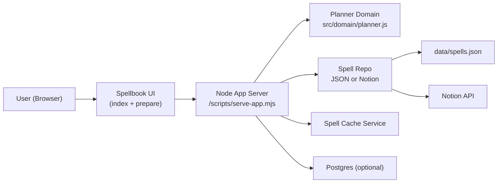
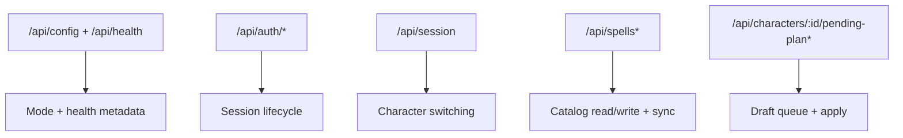
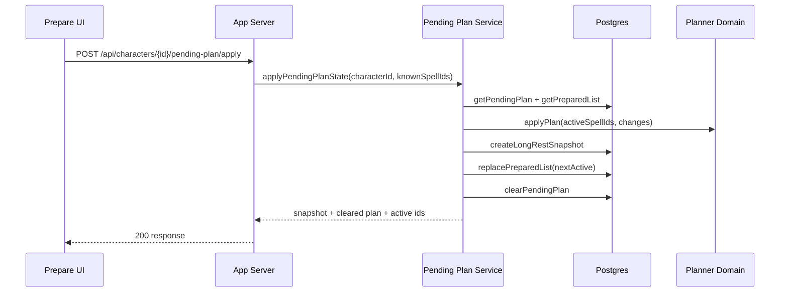
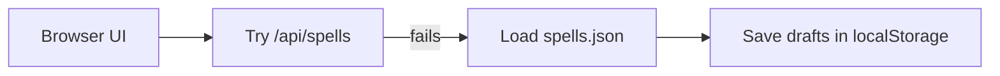

# Diagrams

## System Context

```mermaid
flowchart LR
  U["User (Browser)"] --> UI["Spellbook UI\n(index + prepare)"]
  UI --> APP["Node App Server\n/scripts/serve-app.mjs"]
  APP --> DOMAIN["Planner Domain\nsrc/domain/planner.js"]
  APP --> SPELLS["Spell Repo\nJSON or Notion"]
  APP --> CACHE["Spell Cache Service"]
  APP --> PG["Postgres (optional)"]
  SPELLS --> JSON["data/spells.json"]
  SPELLS --> NOTION["Notion API"]
```

## Main API Route Groups

```mermaid
flowchart TB
  A["/api/config + /api/health"] --> B["Mode + health metadata"]
  C["/api/auth/*"] --> D["Session lifecycle"]
  E["/api/session"] --> F["Character switching"]
  G["/api/spells*"] --> H["Catalog read/write + sync"]
  I["/api/characters/:id/pending-plan*"] --> J["Draft queue + apply"]
```

## Pending Plan Apply Flow (Remote)

```mermaid
sequenceDiagram
  participant UI as Prepare UI
  participant API as App Server
  participant SRV as Pending Plan Service
  participant DB as Postgres
  participant DOM as Planner Domain

  UI->>API: POST /api/characters/{id}/pending-plan/apply
  API->>SRV: applyPendingPlanState(characterId, knownSpellIds)
  SRV->>DB: getPendingPlan + getPreparedList
  SRV->>DOM: applyPlan(activeSpellIds, changes)
  SRV->>DB: createLongRestSnapshot
  SRV->>DB: replacePreparedList(nextActive)
  SRV->>DB: clearPendingPlan
  SRV-->>API: snapshot + cleared plan + active ids
  API-->>UI: 200 response
```

## Static Fallback Flow

```mermaid
flowchart LR
  UI["Browser UI"] --> TRYAPI["Try /api/spells"]
  TRYAPI -->|"fails"| STATIC["Load spells.json"]
  STATIC --> LOCAL["Save drafts in localStorage"]
```
