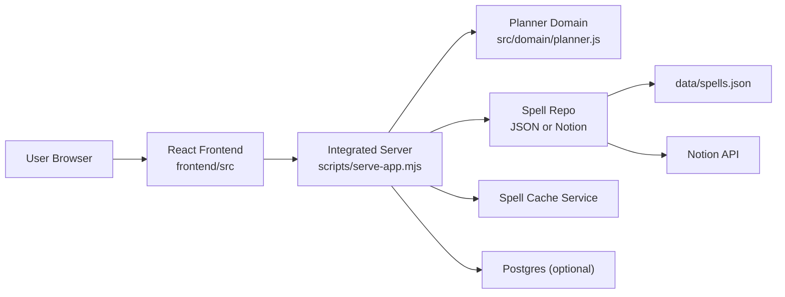
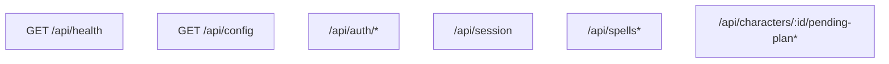
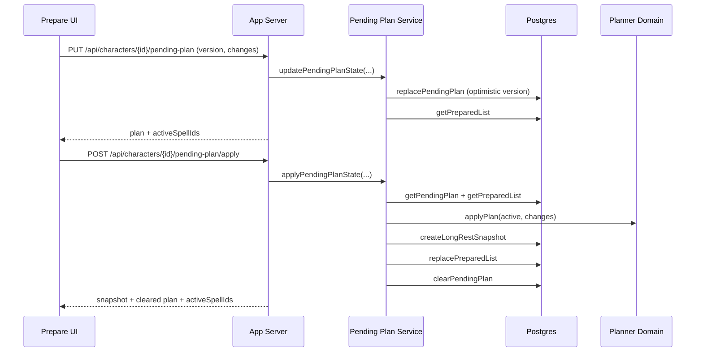

# Diagrams

## System View

```mermaid
flowchart LR
  U["User Browser"] --> FE["React Frontend\nfrontend/src"]
  FE --> API["Integrated Server\nscripts/serve-app.mjs"]
  API --> DOMAIN["Planner Domain\nsrc/domain/planner.js"]
  API --> REPO["Spell Repo\nJSON or Notion"]
  API --> CACHE["Spell Cache Service"]
  API --> PG["Postgres (optional)"]
  REPO --> JSON["data/spells.json"]
  REPO --> NOTION["Notion API"]
```

## Main API Surface

```mermaid
flowchart TB
  H["GET /api/health"]
  C["GET /api/config"]
  AUTH["/api/auth/*"]
  SES["/api/session"]
  SPELLS["/api/spells*"]
  PLAN["/api/characters/:id/pending-plan*"]
```

## Remote Pending Plan Lifecycle

```mermaid
sequenceDiagram
  participant UI as Prepare UI
  participant API as App Server
  participant SVC as Pending Plan Service
  participant DB as Postgres
  participant DOM as Planner Domain

  UI->>API: PUT /api/characters/{id}/pending-plan (version, changes)
  API->>SVC: updatePendingPlanState(...)
  SVC->>DB: replacePendingPlan (optimistic version)
  SVC->>DB: getPreparedList
  API-->>UI: plan + activeSpellIds

  UI->>API: POST /api/characters/{id}/pending-plan/apply
  API->>SVC: applyPendingPlanState(...)
  SVC->>DB: getPendingPlan + getPreparedList
  SVC->>DOM: applyPlan(active, changes)
  SVC->>DB: createLongRestSnapshot
  SVC->>DB: replacePreparedList
  SVC->>DB: clearPendingPlan
  API-->>UI: snapshot + cleared plan + activeSpellIds
```
